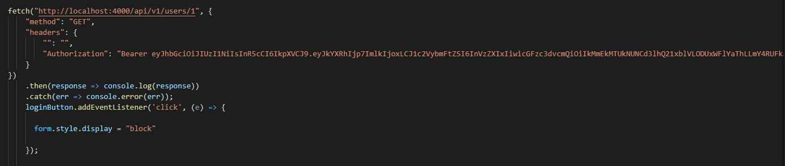

* opgave navn fitness verden app
* mit navn Niclas Hedegaard Jensen
* teknologi/stacks brugt JavaScript HTML CSS flickity
* site url
* url til login form
* evt brugernavn og adgangskode

# Indsats
### Min vurdering af min indsats under dette forløb er at jeg har gjort mit bedste for at kun opfylde alle de stillede mål

# Teknologier

# Argumentationer

### Mit projekt er blevet kodet med HTML css og Javascript. da jeg føler mig tryg i at kode med dette setup og synes det var et godt setup i forhold til den udleverede opgave.

## Jeg har valgt at min overall classes er BEM Dette foretrækker jeg til hver en tid over specificity, da det er meget nemmere at have kontrol med importance når alt ligger i klasser.

# Teknisk dokumentation

### her er et lille stykke kode jeg har valgt at forsøge at hive data fra en user med HTTP metoden "GET" hvor hvis du klikker login vil der komme et login password og login input field hvor du vil skulle skrive User1 som username og 1234 som pw

# URL til siden
### ingen URL da jeg arbejder på localhost

# kanban board
(./eksdag1.png)
(./eksdag2.png)
(./last-part-of-week.png)
